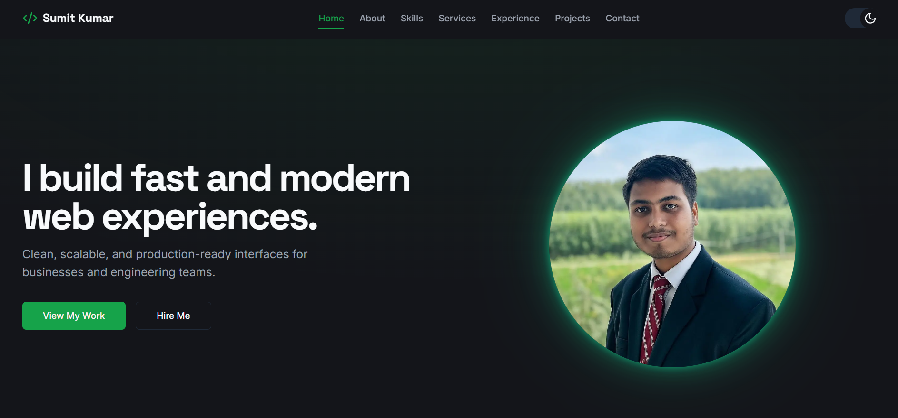
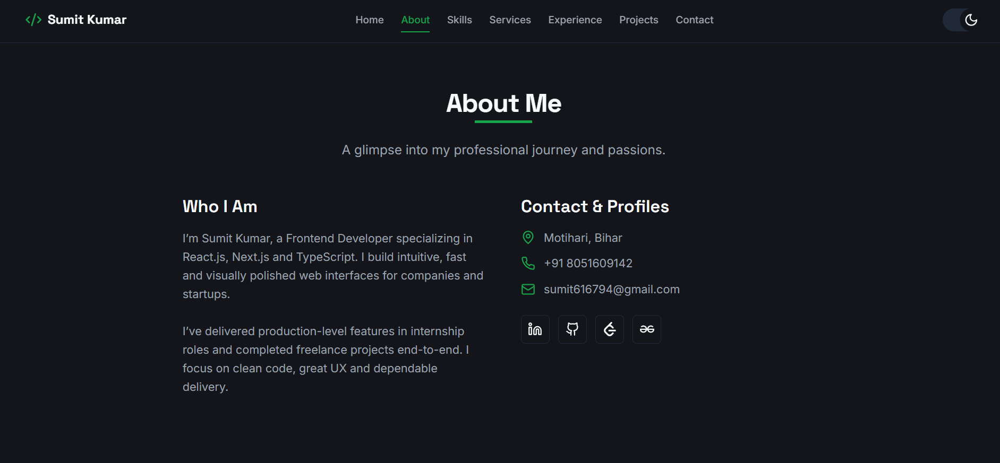
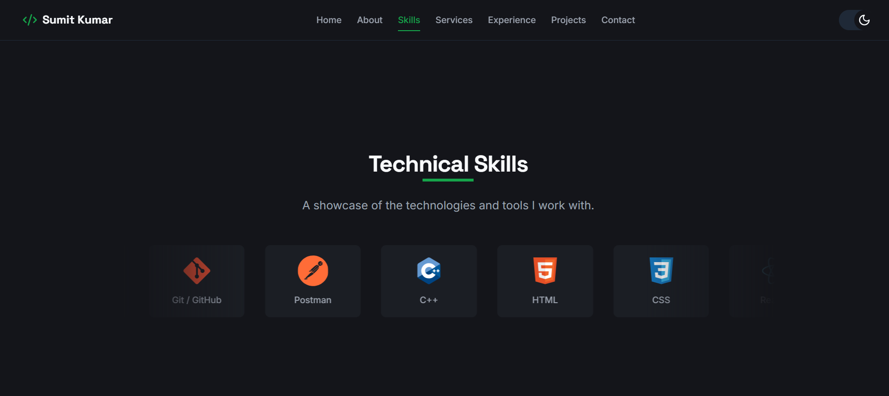
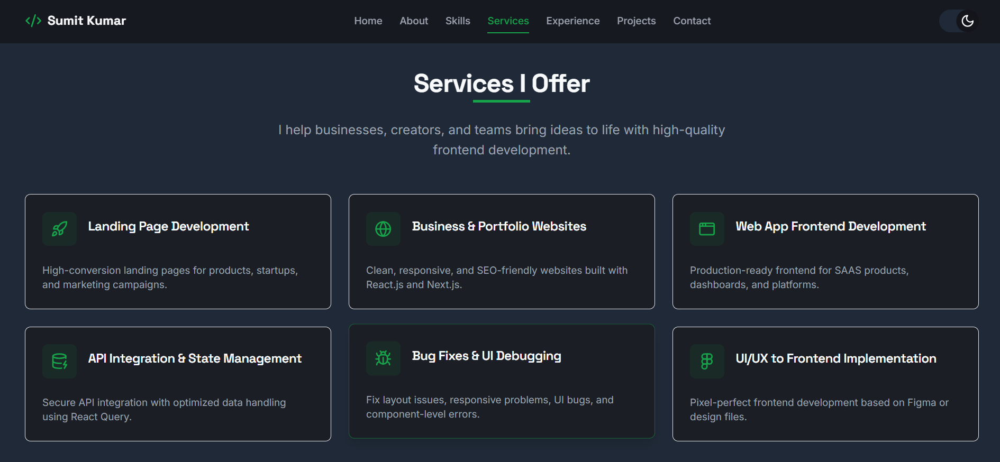
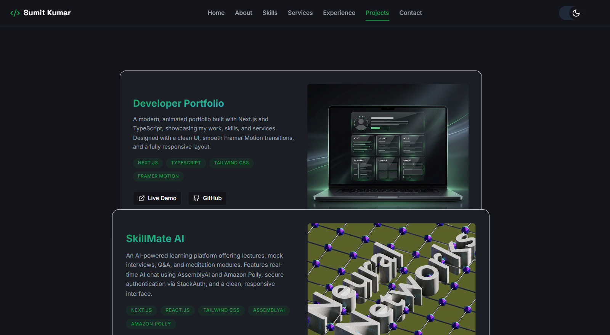
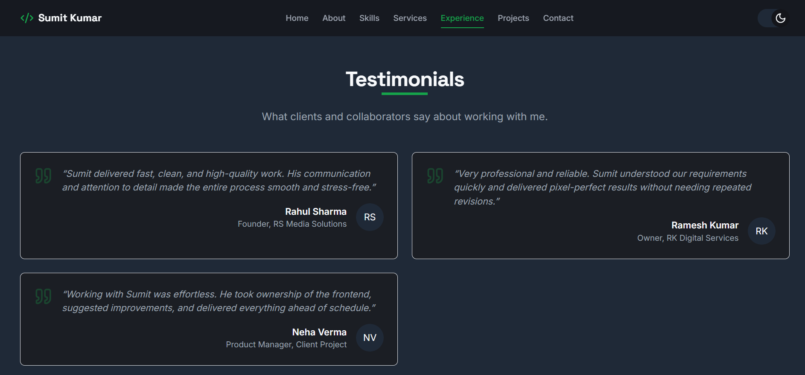
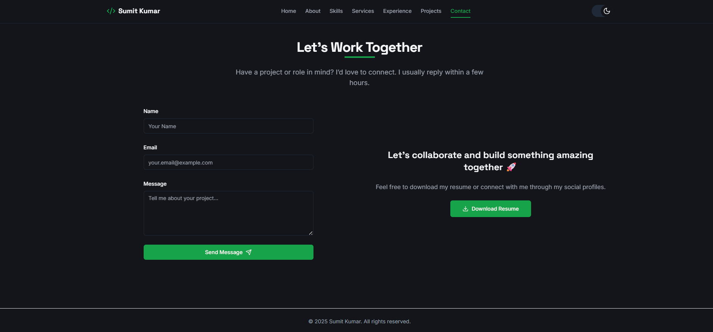

# 🚀 Personal Developer Portfolio — Live Showcase

This repository serves as the **public showcase** for my personal developer portfolio website.  
It includes the **live project link**, a clean project overview, and **high-quality screenshots** of each section.

> 🔒 **Note:** The original source code is stored in a **private repository**.  
> This public repo is created purely for professional review on platforms like **Upwork**, **LinkedIn**, and my personal website.

---

## 🌐 Live Website

👉 **https://sumitkumarfolio.vercel.app**

(If some platforms cannot preview Vercel links due to crawler restrictions, the full screenshot gallery below provides an accurate visual overview.)

---

## 🧭 Project Overview

This is my personal developer portfolio, built to showcase my **skills**, **experience**, and **projects** with a modern, polished, and high-performance UI.

The design focuses on clarity, responsiveness, and a premium aesthetic that reflects my frontend development capabilities.

---

## ✨ Key Highlights

- ⚡ **Fast performance** with Next.js
- 🎨 **Modern UI** using Tailwind CSS
- 📱 **Fully responsive** across all devices
- 🌗 **Light + Dark mode support**
- 🧩 Reusable, scalable component structure
- 🧭 Smooth navigation and animations
- 📄 Dedicated sections: Home, About, Skills, Services, Experience, Projects, Testimonials, Contact

---

## 📸 Full Screenshot Gallery  
*(All screenshots captured in Dark Mode for visual consistency)*

### 🏡 **Home Section**

### 👤 **About Section**

### 🎯 **Skills Section**

### 🛠️ **Services Section**

### ⏳ **Experience Section**

### 🧩 **Projects Section**

### ⭐ **Testimonials Section**

### ✉️ **Contact Section**

---

## 🛠️ Tech Stack

| Category     | Technology |
|--------------|------------|
| Framework    | Next.js |
| UI Library   | React |
| Styling      | Tailwind CSS |
| Icons        | Lucide / Custom SVG |
| Deployment   | Vercel |

---

## 📌 Why This Repository Exists

This **public showcase** repo is created to:

- Present the project to **clients and recruiters**
- Provide screenshots when hosting links are blocked
- Maintain transparency without exposing private source code
- Offer a clean, professional summary of the project

The actual codebase remains private due to structure, security, and professional reasons.

---

## 📬 Contact

If you'd like to collaborate or discuss a project:

**📧 Email:** *sumit616794@gmail.com*  
**🌐 Portfolio:** https://sumitkumarfolio.vercel.app  
**💼 Upwork:** *https://www.upwork.com/freelancers/~012cb8216724998aee*

---

## ⭐ Support

If you found this project helpful or inspiring,  
consider leaving a **star ⭐** on this repository!

